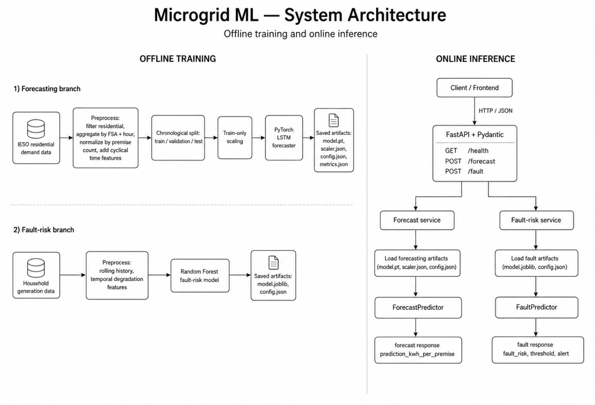
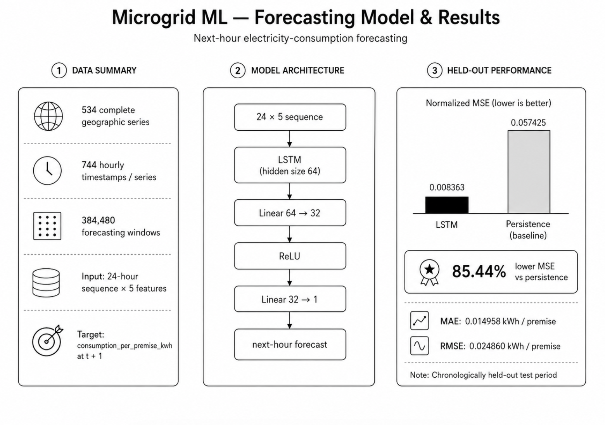
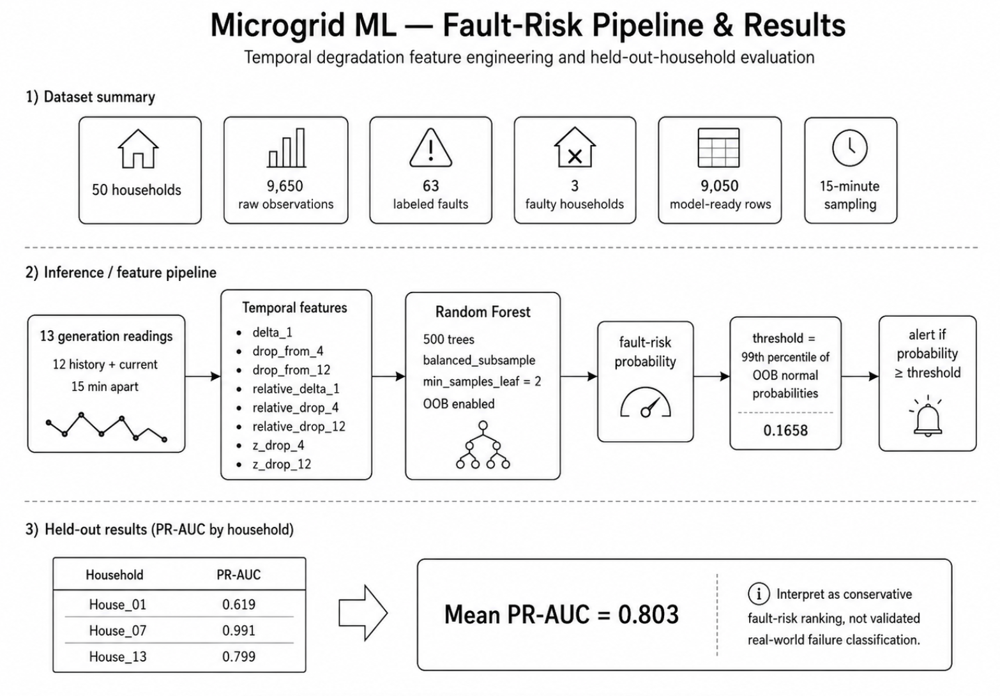
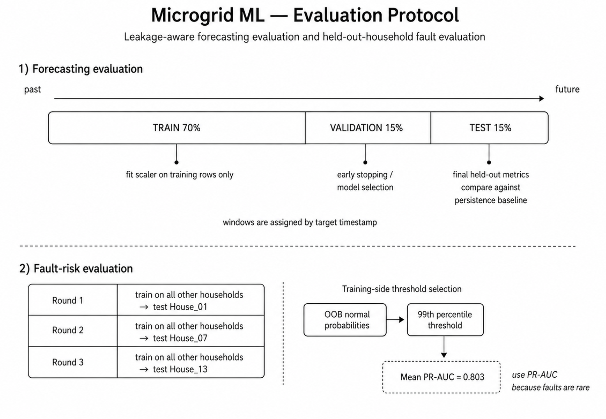

# Microgrid ML


 
Machine learning for next-hour electricity-consumption forecasting and temporal fault-risk detection in community microgrids.

Built with **PyTorch**, **scikit-learn**, and **FastAPI**. Evaluation is leakage-aware throughout: chronological splits for forecasting, held-out-household validation for fault detection, and train-only normalization.

## The Problem

Community microgrids lack accessible tooling for two critical operational tasks: anticipating near-term electricity demand and detecting early signs of generation equipment degradation. Existing approaches either require proprietary SCADA infrastructure or treat evaluation casually, randomly splitting time-series data in ways that leak future information into training and inflate reported accuracy.

## This Project

Microgrid ML builds both capabilities from public and synthetic data with evaluation designed to be honest. The forecaster uses a PyTorch LSTM trained on IESO Ontario residential consumption data with strict chronological splitting and train-only normalization. The fault detector uses a scikit-learn Random Forest trained on household-relative temporal degradation features, evaluated by holding out entire faulty households rather than randomly mixing observations. Both models produce saved artifacts served through a FastAPI backend with Pydantic-validated endpoints.

---

## System Architecture

The system separates offline training from online inference. Two independent ML branches produce saved artifacts that the FastAPI backend loads at startup.



---

## Results at a Glance

### Forecasting

The LSTM forecaster reduces normalized MSE by **85.44%** over a persistence baseline on a chronologically held-out test period.



| Metric | Value |
|---|---:|
| Test normalized MSE | `0.008363` |
| Persistence baseline MSE | `0.057425` |
| MSE reduction | **85.44%** |
| MAE | `0.014958 kWh / premise` |
| RMSE | `0.024860 kWh / premise` |

### Fault-Risk Detection

The fault detector achieves a mean held-out-household **PR-AUC of 0.803** using temporal degradation features and a conservative OOB-derived alert threshold.



| Household | PR-AUC |
|---|---:|
| House_01 | 0.619 |
| House_07 | 0.991 |
| House_13 | 0.799 |
| **Mean** | **0.803** |

---

## Evaluation Protocol

Both tasks use evaluation strategies designed to prevent data leakage.



**Forecasting** uses a strict chronological split (70 / 15 / 15). Normalization statistics are fitted on training data only. The test set is never used for model selection.

**Fault detection** holds out entire faulty households rather than randomly splitting observations. The alert threshold is derived from the 99th percentile of out-of-bag normal-class probabilities, producing a conservative alerting strategy.

---

## Forecasting Pipeline

### Data

Public hourly residential electricity-consumption data from the **Independent Electricity System Operator (IESO)** of Ontario. The raw monthly dataset contains over **1.46 million records**.

After preprocessing:

| Property | Value |
|---|---:|
| Complete geographic series | 534 |
| Hourly timestamps per series | 744 |
| Aggregated observations | 397,296 |
| Forecasting windows | 384,480 |
| Input sequence length | 24 hours |
| Input features | 5 |

### Features

Each hourly input contains:

| Feature | Description |
|---|---|
| `consumption_per_premise_kwh` | Normalized consumption target |
| `hour_sin`, `hour_cos` | Cyclical hour-of-day encoding |
| `dow_sin`, `dow_cos` | Cyclical day-of-week encoding |

Normalizing by premise count prevents large regions from dominating the model purely because they contain more customers.

### Model

A PyTorch LSTM followed by a feed-forward prediction head. Approximately **20K trainable parameters**.

Training uses Adam, MSE loss, chronological validation, early stopping, and best-checkpoint restoration with a fixed random seed.

---

## Fault-Risk Pipeline

### Data

A synthetic household generation dataset with 50 households, 9,650 observations at 15-minute intervals, and 63 labeled fault observations concentrated in 3 households.

### Features

The model uses **household-relative temporal degradation features** rather than household identity:

`delta_1` · `drop_from_4` · `drop_from_12` · `relative_delta_1` · `relative_drop_4` · `relative_drop_12` · `z_drop_4` · `z_drop_12`

### Model

A **Random Forest** classifier with 500 trees, balanced-subsample weighting, and OOB predictions. The production alert threshold is the 99th percentile of OOB normal-class scores.

The detector is treated as a **conservative fault-risk ranking system**, not a high-recall classifier.

---

## API

The backend exposes three endpoints through FastAPI with Pydantic validation.

### `GET /health`

```json
{ "status": "healthy" }
```

### `POST /forecast`

Accepts exactly **24 chronologically ordered hourly observations** spaced one hour apart.

```json
{
  "observations": [
    { "timestamp": "2025-05-29T01:00:00", "consumption_per_premise_kwh": 0.82 }
  ]
}
```

Returns:

```json
{ "prediction_kwh_per_premise": 0.7744 }
```

### `POST /fault`

Accepts exactly **13 chronologically ordered generation readings** (12 historical + 1 current) spaced 15 minutes apart.

Returns:

```json
{
  "fault_risk": 0.6209,
  "threshold": 0.1658,
  "alert": true
}
```

Interactive documentation is available at `/docs` when the server is running.

---

## Repository Structure

```
microgrid-ml-cym2025/
├── assets/                          diagrams
├── backend/
│   ├── app/
│   │   ├── api/
│   │   │   ├── routes/              endpoint handlers
│   │   │   └── schemas/             Pydantic models
│   │   ├── ml/
│   │   │   ├── forecasting/         LSTM pipeline
│   │   │   └── fault_detection/     Random Forest pipeline
│   │   ├── services/                inference orchestration
│   │   └── main.py                  FastAPI entrypoint
│   ├── artifacts/                   saved models + configs
│   └── tests/                       API test suite
├── data/                            datasets
├── frontend/                        React + Vite (WIP)
├── app.py                           legacy Streamlit dashboard
├── requirements.txt
└── README.md
```

---

## Quick Start

### Clone and set up

```bash
git clone https://github.com/cybr-wisp/microgrid-ml-cym2025.git
cd microgrid-ml-cym2025
python -m venv .venv
```

```powershell
# Windows
.\.venv\Scripts\Activate.ps1
```

```bash
# macOS / Linux
source .venv/bin/activate
```

```bash
pip install --upgrade pip
pip install -r requirements.txt
```

### Run the API

```bash
python -m uvicorn backend.app.main:app --reload
```

### Train models

```bash
# Forecasting
python -m backend.app.ml.forecasting.train_ieso

# Fault detection
python -m backend.app.ml.fault_detection.train

# Fault evaluation (held-out-household)
python -m backend.app.ml.fault_detection.evaluate
```

### Run tests

```bash
python -m pytest backend/tests -v
```

```
7 passed
```

---

## Design Decisions

**Chronological splitting.** Random splits leak temporally adjacent windows between train and test. All forecasting data is divided chronologically.

**Train-only scaling.** Normalization statistics are computed exclusively from training-period observations.

**Consumption per premise.** Raw consumption correlates with customer count. Normalizing by premise count produces a comparable target across regions.

**Held-out households.** With only 3 faulty households, random row-level splitting would let nearly identical fault patterns from the same household appear in both sets. Holding out an entire household is a harder and more meaningful generalization test.

**OOB threshold.** Rather than using the default 0.50 classification boundary, the production threshold is derived from training-side OOB statistics, keeping false alarms low.

---

## Limitations

**Forecasting.** Training covers one month of hourly data. The model does not yet incorporate weather, temperature, holidays, electricity prices, or longer seasonal context.

**Fault detection.** The dataset contains 63 labeled faults across 3 households. Results demonstrate methodology, not validated real-world fault-classification accuracy.

---

## Roadmap

### Backend
- [x] FastAPI application with Pydantic validation
- [x] PyTorch LSTM forecaster with chronological evaluation
- [x] Persistence baseline comparison
- [x] Random Forest fault-risk detector with OOB thresholding
- [x] Saved model artifacts and inference endpoints
- [x] API test coverage (7 tests)

### Frontend
- [ ] React + Vite dashboard (replacing legacy Streamlit)
- [ ] Forecasting visualization
- [ ] Fault-risk timeline
- [ ] Model-performance views

### ML
- [ ] Multi-month IESO training data
- [ ] Weather and temperature features
- [ ] GRU and XGBoost forecasting benchmarks
- [ ] Feature ablation studies
- [ ] Larger fault dataset
- [ ] Probability calibration

### Infrastructure
- [ ] Railway backend deployment
- [ ] Production frontend hosting
- [ ] CI test workflow

---

## Tech Stack

| Layer | Tools |
|---|---|
| ML | PyTorch, scikit-learn, NumPy, pandas |
| Backend | FastAPI, Pydantic, Uvicorn |
| Frontend | React, Vite (WIP) |
| Testing | pytest, httpx |
| Legacy | Streamlit |

---

## Background

Microgrid ML began as a CYM 2025 project exploring machine learning for community energy systems. The 2026 rebuild focuses on reproducibility: explicit data provenance, leakage-aware evaluation, meaningful baselines, saved artifacts, honest treatment of dataset limitations, and a clean API boundary between ML and the interface.